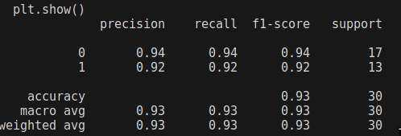

# Stage 2 Interview

## Task:
Quick Simulation:
Generate 50 human and 50 bot sessions (100 total). Each session should include a short sequence of pointer events (x, y, timestamp) and one metadata field (for example, time of day). It is important that the human sessions are not synthetic data. 

Feature & Model:
Engineer 3–5 simple features (for example: velocity statistics, inter‑event timing, direction entropy). Train one classifier (for example: Random Forest) and report ROC‑AUC and precision/recall.

Next‑Step Write‑Up:
In a single page, outline:
- How you would scale this to more realistic data (device sensors, pressure)
- One adversarial scenario and a high‑level defence sketch
- Approaches for low‑latency deployment

## Results

  plt.show()
              precision    recall  f1-score   support

           0       0.94      0.94      0.94        17
           1       0.92      0.92      0.92        13

    accuracy                           0.93        30
   macro avg       0.93      0.93      0.93        30
weighted avg       0.93      0.93      0.93        30

## Walkthrough

In this project, I created a simple CAPTCHA in a python flask application to collect human and bot data. I then take that data and extract features in pandas, which I trained an XGBoost (XGB) model on with a 70-30 train-test split. The accuracy of the XGB model reached 0.933... with no hyperparameter tuning, inference took only 0.00167s, meaning it's relatively low-latency. 

## Potential Improvements

### Data collection
- higher end botting
- more realistic captcha
- increase number of samples
- incorporate mobile device sensors source: 

### Feature Extraction
- Add linearity feature
- Add inverse tangent feature
- Add device sensor information

### Machine Learning
- Not using python, python = slow. prospects: julia, c++
- Automated hyperparameter tuning (optuna, raytune)
- Testing different models (lgbm, rf may be faster for same performance)
- Subsampling: since we have more than 50 of each feature, we can randomly sample
- Luckily, tree-based learners are eager learners. We can spend tons of time on training and not affect inference performance
- 
